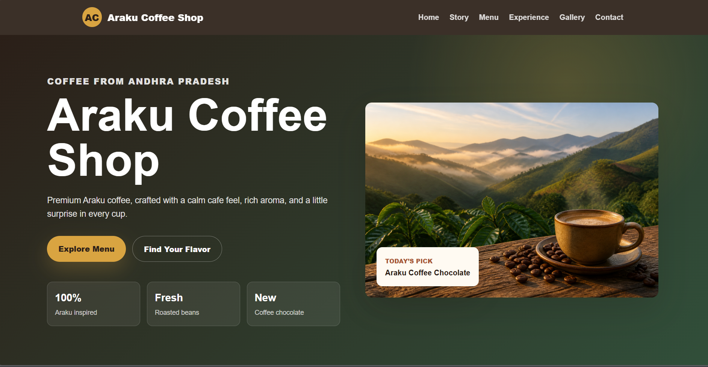

# ☕ Coffee Shop Website

<p align="center">
  
  
  
  
  
</p>

---

## 🌐 Live Demo

🚀 **Website Link:**  
https://rupesh1226.github.io/coffee-shop/

---
## Screenshot



---

## 📖 About The Project

The Coffee Shop Website is a modern and responsive web project created using **HTML, CSS, and JavaScript**.  
It provides a clean and attractive interface for users to explore coffee products, menu items, and café services.

This project focuses on:
- Responsive Design
- Attractive UI
- Smooth User Experience
- Clean Layout Structure

---

## ✨ Features

✅ Fully Responsive Design  
✅ Modern Coffee Shop UI  
✅ Interactive Navigation  
✅ Smooth Scrolling  
✅ Clean and Simple Layout  
✅ Mobile Friendly  
✅ Fast Loading Website  

---

## 🛠️ Built With

- HTML5
- CSS3
- JavaScript

---

## 📂 Project Structure

```bash 
coffee-shop/
│
├── index.html
├── style.css
├── script.js
├── README.md
└── images/
```
---
## 🚀 Getting Started

To run this project locally:
```bash

git clone https://github.com/rupesh1226/coffee-shop.git
```
---
## 💡 Future Improvements
- Add Online Ordering System
- Add Dark Mode
- Add Payment Integration
- Improve Animations
- Add Backend Support
---
## 🤝 Contributing

Contributions are welcome!

If you'd like to improve this project:

- Fork the repository
- Create your feature branch
- Commit your changes
- Push to the branch
- Open a Pull Request
---
## 👨‍💻 Author
Rupesh
- GitHub: https://github.com/rupesh1226

---
## ⭐ Support
If you like this project, give it a ⭐ on GitHub!
